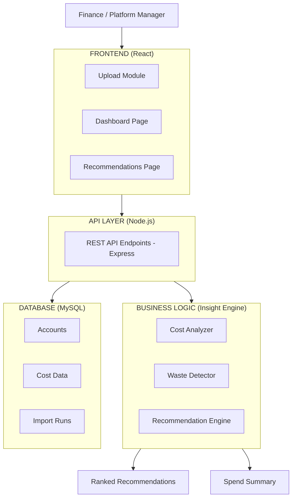

# Architecture — 22North Cloud Cost Intelligence Platform

## Notes

- The frontend uses three logical modules: Upload, Dashboard, and Recommendations.
- MySQL is the primary data store; bundled sample data ensures demos work without a database.
- The insight engine is deterministic — cost analysis, waste detection, and recommendation ranking are all rule-based and explainable.
