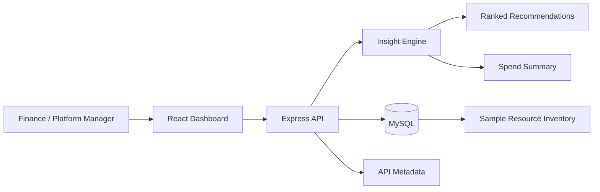

# Architecture Diagram

## Notes

- The frontend only needs two data calls for the MVP: dashboard and metadata.
- MySQL is the primary data store; sample data is bundled so the demo still works if the database is not running.
- The insight engine is intentionally deterministic to keep the prototype explainable in a short demo.
