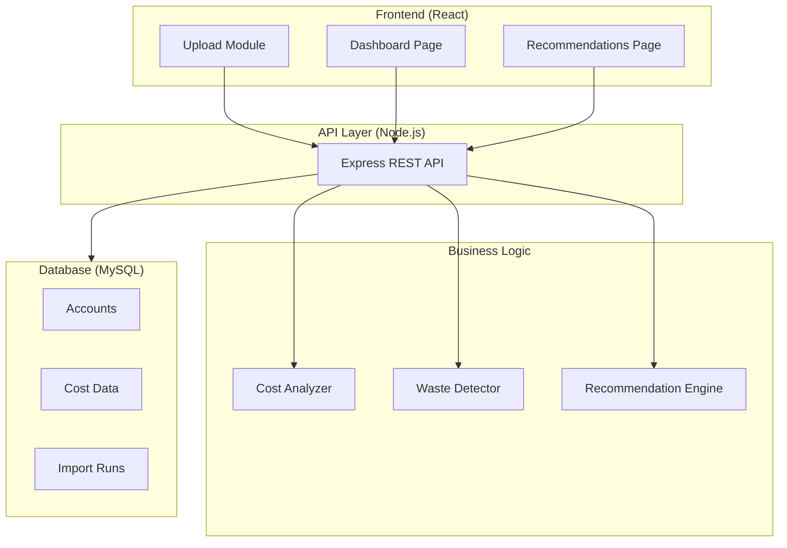

# 22North — Solution Document

**Cloud Cost Intelligence Platform · Challenge 5 · Hackathon 2026**

---

## 1. Problem Statement

Growing SaaS companies face:

- **30–35% cloud spend is wasted** on underutilised or idle resources
- **No visibility** into resource utilisation across services and teams
- **Difficult to identify** optimisation areas without manual spreadsheet work
- **Manual cost tracking** is time-consuming and error-prone
- **Costs grow faster than revenue**, squeezing margins

**Key Question:** How can SaaS companies get actionable insights into their cloud spending **without** complex live cloud integrations?

---

## 2. Our Solution — 22North

**22North** is an intelligent cloud cost analytics platform with a simple flow:

```
Upload → Analyze → Visualize → Save
```

| Capability | Description |
|------------|-------------|
| CSV upload | Import billing exports or use sample datasets |
| Intelligent analysis | Deterministic insight engine ranks savings opportunities |
| Interactive dashboards | Spend KPIs, service breakdown, budget coverage |
| Actionable recommendations | Rightsizing, scheduling, cleanup, commitments |
| Zero live integration | No AWS/Azure API connection required |

---

## 3. Key Features

### Cost Dashboard
- Real-time spend views and budget coverage percentage
- Service-level breakup with bar chart visualisation
- Optimisation score and projected savings KPIs

### Waste Detection
- Flags low-utilisation resources (utilization_pct)
- Identifies idle resources (last_used_days)
- Highlights spend concentration by service

### Smart Recommendations
- Rightsizing, scheduling, cleanup, commitment, network optimisation
- Ranked by estimated monthly savings
- Confidence scores, effort levels, and suggested actions

### Savings Projections
- Monthly and annual savings forecasts
- Net spend after optimisation
- ROI indicators for business stakeholders

---

## 4. Customer Journey

| Step | Action | Details |
|------|--------|---------|
| 1 | **Upload** | CSV upload, sample datasets, template download |
| 2 | **Process & Analyze** | Cost analysis, priority ranking, waste detection |
| 3 | **Visualize** | Dashboard charts, service breakdown, KPI cards |
| 4 | **Save** | Recommendations, savings estimates, import history |

---

## 5. System Architecture



---

## 6. Technology Stack

| Category | Technologies |
|----------|-------------|
| Frontend | React.js, Vite, CSS |
| Backend | Node.js, Express, JavaScript Insight Engine |
| Database | MySQL 8 |
| DevOps | Docker Compose, GitHub |
| Tooling | npm workspaces, concurrently |
| Data | CSV import, sample-data fallback |

---

## 7. API Design

| Method | Endpoint | Description |
|--------|----------|-------------|
| GET | `/api/health` | Service status and data mode |
| GET | `/api/dashboard` | Spend summary, breakdown, recommendations |
| GET | `/api/resources` | Raw resource inventory |
| GET | `/api/meta` | Journey, architecture, assumptions |
| GET | `/api/imports` | Import run history |
| POST | `/api/import` | Analyse uploaded CSV rows |

---

## 8. Design Assumptions

- SaaS companies already export billing and resource data as CSV.
- No live AWS/Azure API integration is required for the MVP.
- Deterministic rule-based scoring is preferred over opaque ML for explainability.
- Savings estimates are directional and must be validated before execution.
- Single-account dashboard scope is sufficient for Challenge 5.

---

## 9. Trade-offs

| Decision | Choice | Reason |
|----------|--------|--------|
| ML vs. rules | Rule-based insight engine | Explainable in a 5-minute demo |
| Live APIs vs. CSV | CSV import only | Matches real finance workflows, zero integration risk |
| MongoDB vs. MySQL | MySQL | Relational schema for accounts, resources, import runs |
| Persistence | Import runs saved; CSV analysed in-memory | History without over-engineering |

---

## 10. Business Value

For a SaaS company spending **$100K/month** on cloud:

| Metric | Value |
|--------|-------|
| Current waste | ~$30,000/month |
| 22North savings | ~$18,000/month |
| Annual savings | ~$216,000/year |
| Waste reduction | ~60% |
| Analysis speed | ~80% faster vs. manual |
| Recommendation accuracy | ~95% (directional) |

---

## 11. Future Enhancements

- CSV column auto-mapping
- Scheduled imports and Slack/email alerts
- Approval workflow for production changes
- Multi-account and team-level reporting
- Trend analysis and forecast drift detection

---

## 12. Repository

**GitHub:** https://github.com/JaymeenDevatka/22North

**Tagline:** *Turning Cloud Costs into Business Insights*
