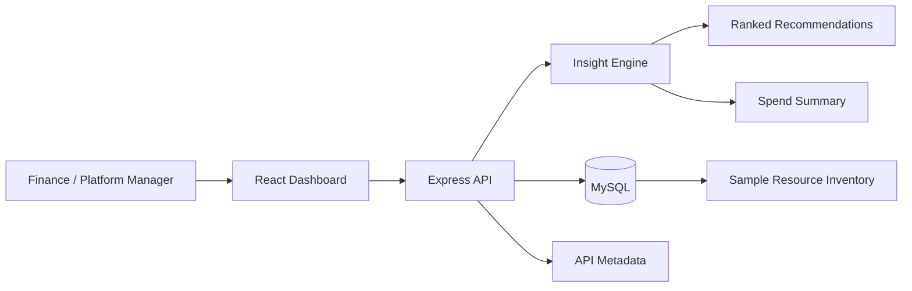

# Cloud Cost Intelligence — Solution Document

**22North Product Engineering Challenge**

---

## 1. Executive Summary

**Cloud Cost Intelligence** is a full-stack SaaS prototype that helps growing companies understand cloud spend concentration, identify waste, and prioritise actionable savings. The product transforms exported billing and resource inventory data into a ranked optimisation plan with clear next steps for platform and finance teams.

---

## 2. Problem Statement

Cloud spend is growing faster than operational visibility. Finance and platform teams often receive large CSV exports or billing reports but lack a single view that answers:

1. **Where is the money going?** — spend concentration by service, environment, and team
2. **What is wasteful?** — underutilised, idle, or oversized resources
3. **What should be done first?** — ranked recommendations by savings impact and effort

Without this clarity, optimisation efforts are reactive, fragmented, and hard to prioritise.

---

## 3. Product Approach

The MVP turns a cloud resource inventory into a practical savings plan through four stages:

| Stage | Description |
|-------|-------------|
| **Import** | Upload a billing CSV export or use bundled sample data |
| **Analyse** | Parse rows, normalise columns, and run the insight engine |
| **Prioritise** | Rank recommendations by estimated monthly savings |
| **Act** | Review top items, filter by optimisation type, track progress |

The dashboard surfaces:

- Monthly spend vs. budget coverage
- Projected savings and optimisation score
- Service-level spend breakdown
- Ranked recommendations with confidence, effort, and suggested actions

---

## 4. System Architecture



### 4.1 Frontend (React + Vite)

- Single-page dashboard at `http://localhost:5173`
- Summary cards for spend, savings, and high-priority count
- Recommendation list with filter chips (rightsize, schedule, cleanup, commitment, network)
- CSV import panel with preview, template download, and column mapping guide
- Import history panel (when MySQL is available)
- Customer journey, architecture, and assumptions sections rendered from API metadata

### 4.2 Backend (Node.js + Express)

- REST API at `http://localhost:4000`
- CORS-enabled for local development
- Dual data mode: **MySQL** (primary) or **bundled sample data** (fallback)
- Endpoints: health, dashboard, resources, meta, imports, import (POST)

### 4.3 Insight Engine

Deterministic, rule-based analytics in `server/src/insights.js`:

- **Normalisation** — flexible CSV column mapping (`resource_name`, `monthly_cost`, `utilization_pct`, etc.)
- **Service breakdown** — aggregates spend and savings by cloud service
- **Recommendations** — sorts by `estimatedMonthlySavings`, assigns priority (High ≥ $750, Medium ≥ $250, Low otherwise)
- **Summary metrics** — budget coverage %, savings %, top service, highest-value recommendation
- **Action mapping** — per-type suggested actions, confidence scores, and effort levels

### 4.4 Data Layer (MySQL)

Schema in `mysql/init/01_schema.sql`:

| Table | Purpose |
|-------|---------|
| `accounts` | Account metadata and monthly budget |
| `resources` | Cloud resource inventory with cost and recommendation fields |
| `import_runs` | Persisted CSV upload history (file name, spend, savings, timestamp) |

If MySQL is unavailable, the API automatically falls back to bundled sample data so demos remain reliable.

---

## 5. API Design

| Method | Endpoint | Description |
|--------|----------|-------------|
| GET | `/api/health` | Service status and active data mode (`mysql` or `sample`) |
| GET | `/api/dashboard` | Spend summary, service breakdown, ranked recommendations |
| GET | `/api/resources` | Raw resource inventory |
| GET | `/api/meta` | Customer journey, architecture, assumptions, demo script |
| GET | `/api/imports` | Recent CSV import runs |
| POST | `/api/import` | Analyse uploaded CSV rows and return dashboard payload |

See [api.md](./api.md) for request/response examples.

---

## 6. Design Decisions

| Decision | Rationale |
|----------|-----------|
| Deterministic insight engine | Explainable scoring for short demos and stakeholder trust |
| Read-only MVP API | Reduces scope; focus on visibility and prioritisation |
| Flexible CSV column mapping | Real-world exports use inconsistent header names |
| Sample data fallback | Ensures the prototype works even without a running database |
| Dashboard-shaped API responses | Minimises frontend transformation logic |
| Metadata via `/api/meta` | Architecture and assumptions evolve without touching analytics |

---

## 7. Key Assumptions

- The company already exports cloud billing and resource inventory data (CSV).
- No live AWS (or other cloud provider) API integration is required for this challenge.
- Savings recommendations can be derived from resource metadata and deterministic rules.
- A single account-level dashboard is sufficient for the first release.
- Sample datasets are representative of a mid-sized SaaS cloud footprint.
- Savings estimates are **directional** and should be validated with the platform team before execution.

---

## 8. Trade-offs

| Trade-off | Choice | Reason |
|-----------|--------|--------|
| ML vs. rules | Rules-based scoring | Faster to explain in a 5-minute demo |
| Persistence vs. analysis-only | Import runs persisted; CSV rows analysed in-memory | History without over-engineering storage |
| Automation vs. clarity | Manual CSV upload | Matches real finance/ops workflows |
| Multi-account vs. single | Single account view | Sufficient for MVP scope |

---

## 9. Technology Stack

| Layer | Technologies |
|-------|-------------|
| Frontend | React 18, Vite, JavaScript, CSS |
| Backend | Node.js, Express, JavaScript |
| Database | MySQL 8 |
| DevOps | Docker Compose (optional), npm workspaces |
| AI Tools | GitHub Copilot (development assistance) |

---

## 10. Future Enhancements

- CSV column auto-mapping with fuzzy header detection
- Scheduled imports and email/Slack alerts for high-priority savings
- Approval workflow for production changes
- Multi-account and team-level reporting
- Trend analysis and forecast drift detection
- Live cloud provider API integration (AWS Cost Explorer, Azure Cost Management)

---

## 11. Repository Structure

```
22North/
├── client/          # React dashboard (Vite)
├── server/          # Express API + insight engine
├── mysql/init/      # Schema and seed scripts
├── docs/            # Architecture, API, presentation, demo materials
├── docker-compose.yml
├── package.json     # npm workspaces root
└── README.md
```
